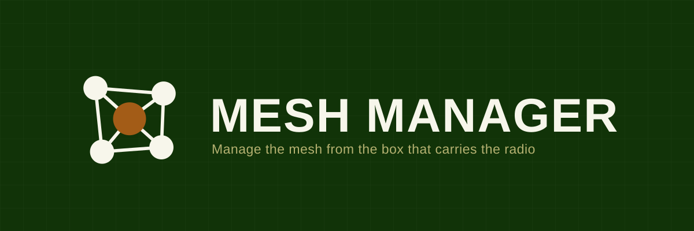
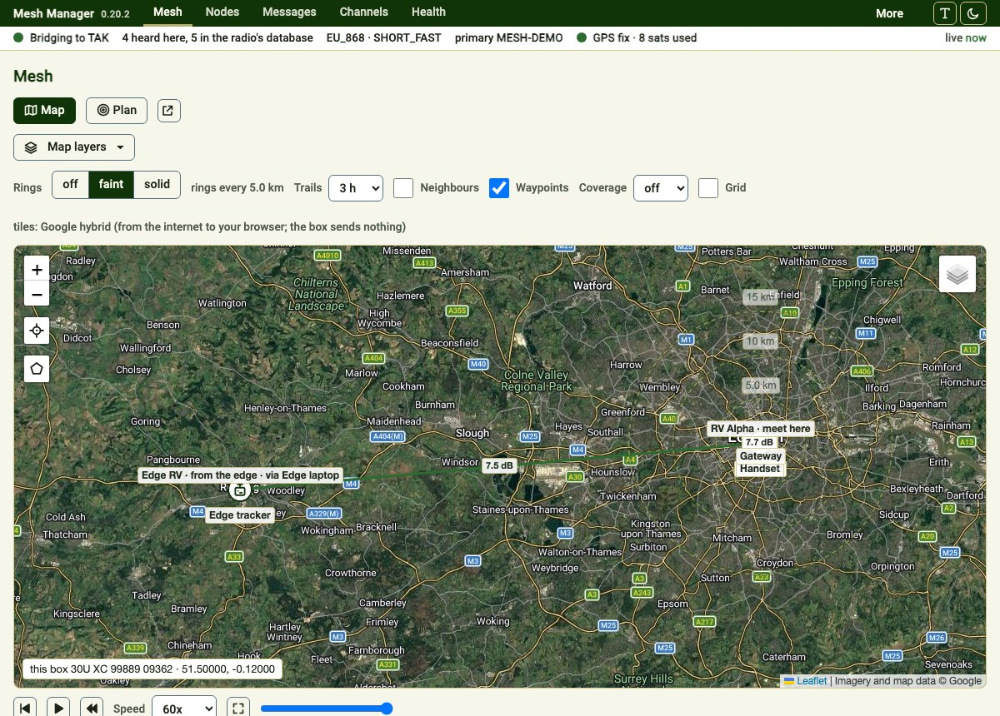
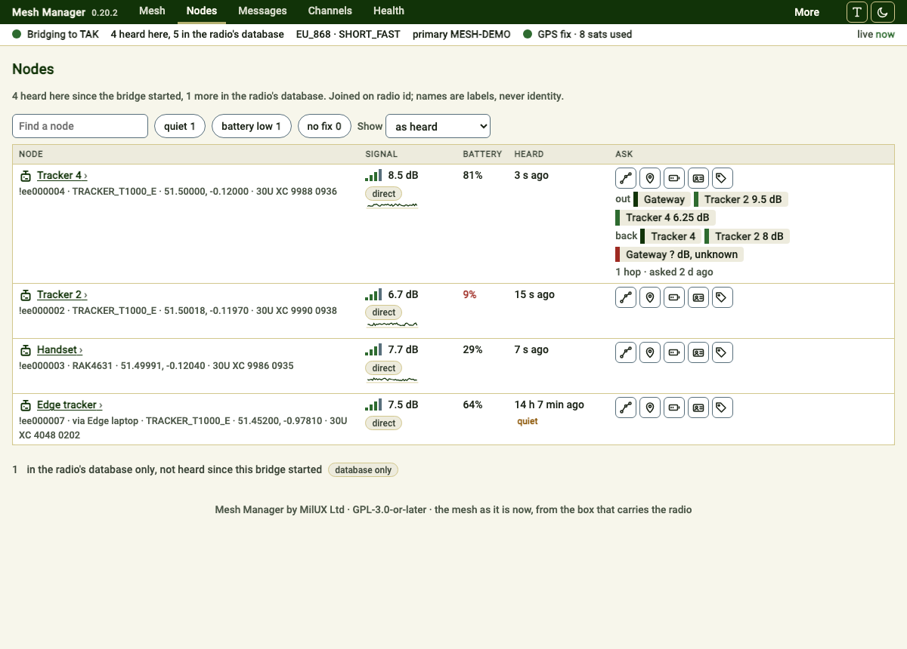
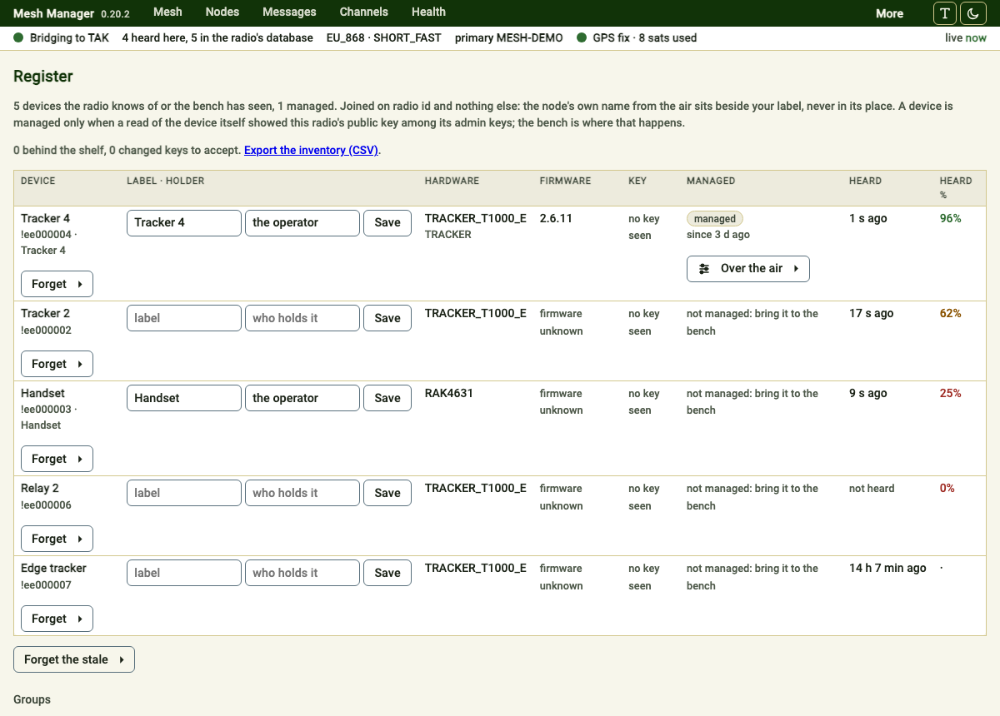
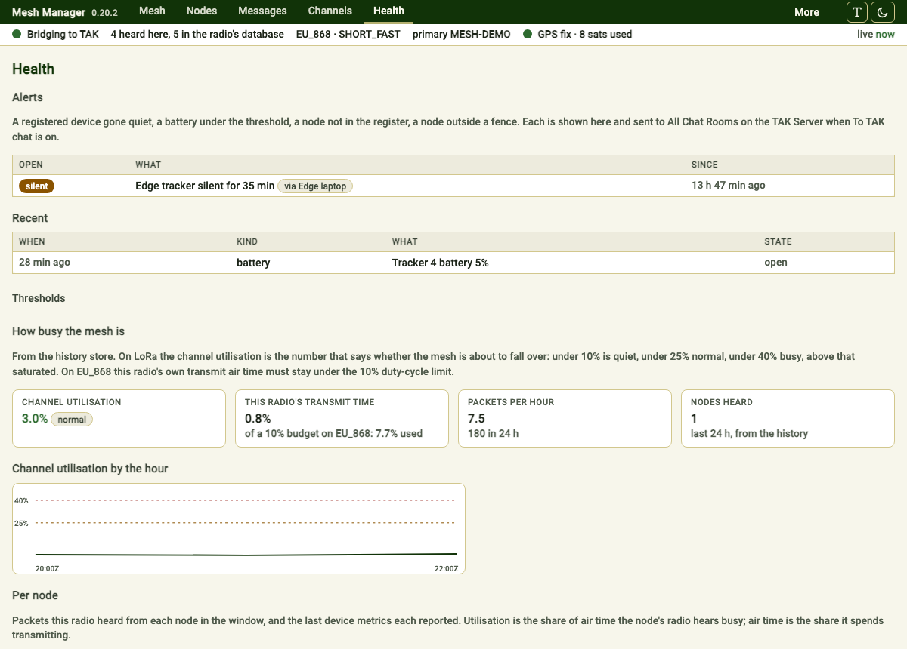

<p align="center">
  
</p>

<p align="center"><strong>Manage the mesh from the box that carries the radio.</strong></p>

<p align="center"><a href="../../actions/workflows/tests.yml"></a>
<a href="../../actions/workflows/verify-public.yml"></a></p>

Mesh Manager runs on the computer the Meshtastic gateway radio is plugged into. It shows the
mesh as it is now, manages the devices on it, and bridges that mesh into TAK. One screen for
the radio layer under a deployment: what is out there, how well it is heard, where it is, what
is left in its battery, and what to do about any of it.

Most tools in this space watch a mesh. This one manages it: devices set up on the bench and
administered over the air, firmware from a verified shelf, channels minted and rotated, and
an agent that can do everything the screen can under rules you set.

<p align="center">
  
</p>

<p align="center"><em>The mesh on the map, with range rings that follow the zoom and MGRS under the cursor.
Tiles here are OpenStreetMap; Google, your own offline MBTiles and any ATAK custom map source also work.</em></p>

**Status: 0.x.** In daily use on its author's own deployable kit and released often. The
version line stays 0.x until the interface settles; the
[releases page](../../releases) has the current one.

## What it does

- **The bridge.** Owns the gateway radio and forwards mesh traffic to a TAK Server as CoT,
  the tracker path and the phone path both. Its liveness is measured at the serial read loop,
  so a dead serial handle restarts it instead of leaving a live process and a silent mesh.
- **The mesh, live.** Every node the radio hears, with signal, hops, position, battery and a
  history behind each figure. Nothing on the screen reloads.
- **The map.** Nodes and links over Google, OpenStreetMap, the box's own offline MBTiles, or
  any ATAK custom map source you already carry. Trails that fade with age, a coverage layer
  of every position heard coloured by signal, range rings that follow the zoom, MGRS beside
  every position with a 1 km grid, and a pop-out window for a wall display.
- **The fleet.** A register of the devices you own. On the bench over USB: read, export,
  onboard, restore, and flash from a shelf verified by hash. Over the air: rename, region,
  channel push, reboot, every write read back before it is shown as done.
- **Health and alerts.** Channel utilisation with a plain verdict, transmit air time against
  the region's duty-cycle budget, packets per hour. A device gone quiet, a flat battery, an
  unknown node on the channel or a node outside a fence each raise an alert on the screen and
  a chat message into TAK.
- **The mesh as a graph.** Who hears whom, at what SNR, from the neighbour-info reports nodes
  broadcast; drawn on its own page and as edges on the map.
- **Receipts, sensors and history.** A text reads delivered or says why not. Temperature,
  humidity and pressure from sensor nodes. How much of the day each node was actually heard for.
  A packet inspector. Playback of the last hours on the map. Export as GPX, KML or CSV.
- **Waypoints across the bridge.** A pin dropped on the mesh reaches TAK as a marker, and the
  screen can drop one.
- **Groups, icons and fences.** Put radios in groups with a map icon each, filter the map, the
  lists, the alerts and the exports by group, message a group, and draw fences on the map that
  alert when a radio crosses. Playback replays the window on a timeline with a row per node.
- **Inventory.** Hardware, firmware (as each device reported it), the key each radio holds and
  since when; a changed key is an alarm until you accept it; behind the shelf's image is a word.
- **On your phone.** Installable from the browser (a manifest and icons, no service worker),
  44 px targets, tooltips on a long press, every icon with a word behind a switch.
- **Updates.** The screen checks for a release, verifies its hash, and applies it on one
  press, and can roll back to any release still on the box. The box downloads nothing else.
- **Joining meshes.** Two sites out of radio range join over the internet, box to box, with no
  broker: each sends what its own table lets out, items carry the site they came from, and a
  site with a radio can put a peer's messages on its own air. What a link may never carry is
  enforced in code, not by convention.
- **On a laptop.** The same product as an application on macOS and Windows: it finds the radio
  on USB, shows the screen in its own window, and sits in the menu bar or the notification area.
  No server, no TAK, no systemd.
- **An AI surface.** An MCP endpoint, an agent role and a set of skills, all derived from the
  same action catalogue the screen uses. Anything a person can do on the screen an agent can
  do through a connector, at the autonomy you set, and nothing else.

## The guide

[docs/GUIDE.md](docs/GUIDE.md) walks through every page in the order a new user meets it, with
screenshots from the demo: setting up, the map and its layers, nodes, messages, channels, the bench,
the register, health and alerts, settings, updates, connections and help.

## What it looks like



Every node the radio hears, with signal, battery and age, the link quality out and back on each
hop, and the actions for that node on the row: ask for a position, ask for a battery, trace the
route, set a label.



The register of devices you own, whether the gateway can administer each one over the air, and
the fleet profile the drift check compares them against.



Whether the mesh is healthy, in numbers with a verdict rather than raw counters: channel
utilisation, the gateway's own transmit air time against the region's duty-cycle limit, and any
alert currently open.

## What it needs

A Linux box with a Meshtastic radio on USB and Python 3.11 or later. A TAK Server beside it is
optional: with one, the bridge forwards the mesh to it as CoT; without one, install with
`--mode server` and the box manages the mesh on its own. Everything else travels in the release. The reference deployment is
a mini PC with a Heltec V4 gateway radio and Seeed T1000-E trackers, but nothing about the
hardware is hard-coded.

On a laptop it needs nothing but the application: the macOS and Windows builds carry their own
Python and every library inside them.

## Install

Take the release tarball and its `install.sh` from the
[releases page](../../releases), then, as root on the box:

```bash
./install.sh mesh-manager-<version>-amd64.tgz \
  --serial /dev/serial/by-id/<your radio> \
  --filter-group <your TAK group>
```

Two or more sites out of radio range join over the internet, box to box, no broker: one site listens
(a hub, or any box with `--peer-bind`), the other joins with a one-time code from its Connections page,
and each shows the other's nodes marked with where they came from. A hub is a site with no radio:

```bash
./install.sh mesh-manager-<version>-amd64.tgz --mode hub --site-address <this machine's name>
```

On a box with no TAK Server, the server shape instead:

```bash
./install.sh mesh-manager-<version>-amd64.tgz \
  --serial /dev/serial/by-id/<your radio> \
  --mode server
```

`--help` lists the rest: where to bind, whether to ask for a password, where the map tiles
live, how the box knows where it is, and how it updates. A dry run prints every line it would
write and changes nothing. The box builds its environment from wheels inside the tarball, so
the install works with no internet.

After that, updates are a press on the About page.

A screen reached from a browser elsewhere can have a name and a certificate of its own: add
`--tls-route <host>` and the installer puts Caddy in front of it, leaving the firewall to you.

### On a laptop

Take the disk image or the Windows zip from the [releases page](../../releases). The application
finds the radio on USB, shows the screen in its own window, and sits in the menu bar on macOS or
the notification area on Windows; closing the window leaves the bridge running, and Quit stops
it. With no radio it shows the demo mesh, so it can be looked at before any hardware arrives.

Neither build is signed by Apple or Microsoft yet, so the first run needs right-click then Open
on a Mac, or More info then Run anyway on Windows.

## Try it without a radio

[`docs/DEMO.md`](docs/DEMO.md) runs the whole screen against a demo bridge on any machine
with Python. No hardware, no TAK Server, nothing to undo afterwards:

```bash
python3 -m mesh_manager.demo /tmp/mm-demo.sock &
python3 -m mesh_manager.web --config /nonexistent --socket /tmp/mm-demo.sock \
    --etc "$(mktemp -d)" --bind 127.0.0.1 --port 8095 --no-auth
```

## Licence

**GPL-3.0-or-later.** Mesh Manager stands on the Meshtastic Python library and on
TAK-Meshtastic-Gateway, both GPL-3.0-or-later, so Mesh Manager is too. You may run it, study
it, change it and pass it on under the same terms. If you distribute it, or a device with it
on, the source goes with it.

Third-party work it stands on, each under its own licence with attribution kept, is listed in
[`NOTICE`](NOTICE); the licence texts travel inside every release under `LICENSES/`.

## Reporting a security fault

Not in a public issue. Use the **Security** tab of this repository, then **Report a
vulnerability**, which opens a private thread. [`SECURITY.md`](SECURITY.md) says what to
expect, which versions get fixes, and what counts as a fault in something that sits on the
box carrying a deployment's radio.

## Not affiliated

Meshtastic is a registered trademark of Meshtastic LLC. TAK, ATAK and the TAK Product Center
are the property of their respective owners. This project is not affiliated with, endorsed by
or supported by either, and ships neither TAK Server nor device firmware: you supply both.

## What travels with it

`tests/` holds the product's own suites, which run on every push here; `tests/README.md` says how to run them yourself. `SECURITY.md` is the disclosure route and the security model in brief.
`release/verify-public.sh` checks a published release the way a stranger receives it, with no
credentials: run it yourself against this repository if you want to confirm what you
downloaded matches what is published. `CHANGELOG.md` is the record of what changed and why. `NOTICE` and `THIRD-PARTY.md` name the
third-party work this stands on, with the licence texts under `LICENSES/`. `agents/` and
`skills/` hold the agent role and the skills for the AI surface, and `install/` holds the
installer and the systemd units. The design notes and the build record stay in the private
repository this is cut from: they are about the firm that builds it, not about running it.

---

Built by [MilUX Ltd](https://milux.co.uk).
