# Mesh Manager: the guide

Mesh Manager runs on the box that carries the gateway radio and shows the mesh as it is now. This
guide walks through the screen in the order a new user meets it. Every screenshot is from the demo,
with synthetic radios, so the names and positions are made up; the layout is the real one. Every
time on the screen is Zulu.

Two habits carry through the whole product. Nothing is shown as done until the radio, or the device
on the bench, has answered with it: a write reads *sent, waiting for the read-back* until then. And
every icon has a name: hover, or hold a finger on it, or press **Words on buttons** in the header to
see the word beside every glyph.

## Setting up

Open the address of the box in a browser on the same network (the installer prints it). If sign-in is
on, the operator password is the one set at install. The Help page opens with the six steps, each a
link:

1. Name this radio and check its region and preset on **Radio** (under More). Every device on the
   mesh must share the region and the preset.
2. Mint a channel of your own on **Channels**, or adopt a join URL you were given. The default
   channel's key is everyone's key.
3. Show the join QR to a phone, or onboard a device on the **Bench** by USB.
4. Say where the box is on **Settings** if it has no GPS receiver, so the map has a centre.
5. Watch the picture on **Mesh** and **Nodes**.
6. Point it at TAK: the bridge speaks to the TAK Server the installer was given.

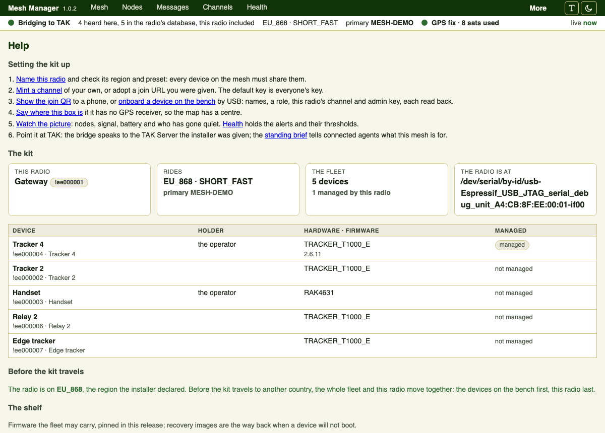

### A box without TAK

Not every mesh has a TAK Server beside it. A box installed with `--mode server` manages the mesh on
its own: the state strip reads *Managing the mesh*, the home page shows the last packet heard, and
nothing on the screen speaks of TAK or forwarding. Everything else in this guide applies as it is.

### On a laptop

On a Mac, open `Mesh Manager.app` from the disk image: it appears in the menu bar, not the Dock, finds the radio
on USB (or shows the demo mesh when there is none), and shows the screen in its own window. Closing that window
does not stop anything: the bridge keeps running and the menu-bar item brings the window back, or opens the
screen in a browser if you would rather. Opening the app a second time shows the copy already running rather
than starting another, since only one thing can hold the radio. If a run goes wrong, `log/app.log` beside its
other files says why. The menu says what the radio is doing, and carries Open Mesh Manager,
Open in a browser, Show the files, and Quit, which stops everything. The first time, if macOS says the app is
from an unidentified developer, right-click it and choose Open: the build is signed by us but not yet by Apple,
and notarisation follows.

A laptop is a site like any box, so it can **join a hub**: take an invite from the hub's Connections page and
paste it into Join a site on the laptop's own. From then on what your radio hears reaches the other sites, and
theirs reaches you, under the same sharing table a box has. The laptop dials out, so nothing has to be opened on
the network you are sitting on, and nobody can dial in to it. With no radio plugged in it is still a site: it
says it is watching for one, joins and shows what its peers send, and takes a radio the moment one appears. The
demo mesh is what `--demo` asks for, not what a missing radio gives.

A laptop is also a **bench**: a radio you plug in that is not the one it is using appears on the Bench page,
with its maker and serial number where the device says them, ready to read, onboard and set up. On a laptop
with no radio of its own, everything plugged in is bench kit. Flashing works from a laptop too: a device held
in its bootloader appears as a small removable volume, and the bench copies the pinned firmware onto it and
waits for the radio to come back, on a Mac as on a box.

From a terminal instead, with the release installed in a virtual environment, `mesh-manager-desktop` does the
same without the menu bar, and `--in-process` runs both parts in one process as the app does. Either way the
files live under the platform's application directory (on a Mac, `Library/Application Support/Mesh Manager` in
your home), there is no sign-in on the laptop's own loopback, and there is no TAK.

### On Windows

Unzip the release's Windows folder and run `Mesh Manager.exe`. It shows the screen in its own window and sits in
the notification area by the clock: the menu says what the radio is doing and carries Open Mesh Manager, Open in
a browser, Show the files, and Quit. Closing the window leaves the bridge running, as on a Mac.
The files live under `Mesh Manager` in your local application data. Windows SmartScreen will warn that the
publisher is unknown, because the build is not signed yet: choose More info, then Run anyway, or leave it until
a signed build is out. Inside, the screen and the bridge talk over the loopback interface with a token made for
that run, because Windows has no Unix socket; nothing of it is reachable from the network.

### A name and a certificate for the screen

The screen listens on loopback. A hub, or any box you want to reach from a browser without a tunnel, takes
`--tls-route <host>` at install: Caddy is installed from the distribution, a site block fronts the screen at
`https://<host>` with a Let's Encrypt certificate, and About says where the screen is reached. The installer
does not touch the firewall; it prints the two lines, `ufw allow 80/tcp` (the certificate is fetched over 80)
and `ufw allow 443/tcp` (the screen), for you to run. Sign in is the operator password as before; the session
cookie is marked Secure over the route.

## The mesh and the map

The Mesh page is the map, then three cards about the box, then the rest folded under *The box in
detail*. The state strip under the header is on every page: the lamp and the words say whether the
bridge is running and the radio is connected, how many nodes are heard, the region and preset, the
primary channel, the GPS, and how long since the box last spoke to this page. On a phone the strip
folds behind a chevron.

**Map** and **Plan** are two views of the same mesh: the map over imagery when the box has a
position, the plan as rings by hop count when it has not. **Map layers** holds what the map draws
besides the nodes: range rings (off, faint, solid), trails over a window, the neighbour graph,
waypoints, the coverage layer from a survey walk, the MGRS grid, and a group filter. The icon with
the arrow opens the map in a window of its own.

Each node is drawn as its icon in a circle; a link from the box is coloured by the signal of the
last packet that came straight from that node, dashed when it has only ever come through a relay.
The readout at the bottom left gives MGRS and degrees under the pointer. Under **Centre** are two
controls: centre on this box, and draw a fence.

**Fences.** Press the outline control, press the corners on the map, then **Finish** (or press
**Circle instead** and set a radius). Name the fence, choose whether it alerts on coming in, going
out or either, and whether it applies to everyone or one group. A device crossing raises an alert
on Health and in TAK chat.

**Waypoints.** *Drop a waypoint on the mesh* under the map sends a named pin to every device and
to TAK. Press **Place it on the map** and then the map, or type a grid reference; either fills the
degrees.

**Playback.** Under the map, a timeline shows a row per node and a tick per position report, so
you can see the gaps before you press play. Press or drag anywhere on it to seek; press a name to
hide that node. Play, to the start, reverse, a speed, and fit the map to the tracks; space, the
arrows, `[` `]`, `r` and `f` do the same from the keyboard. Nothing is interpolated: a node sits
where it last reported, hollow with its age when that report is older than its usual gap.

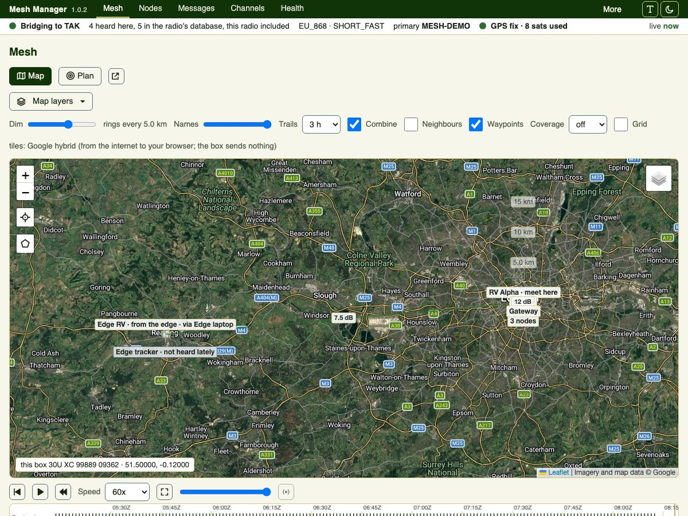

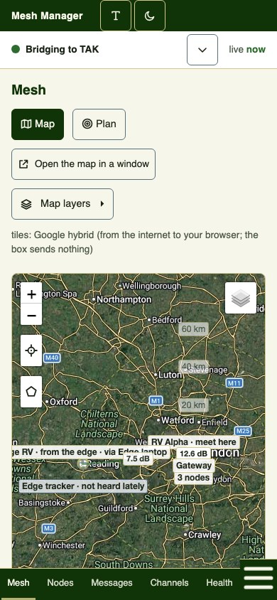

## Nodes

Every node the radio hears, with its signal (bars and the figure, and a sparkline of recent
readings), its battery, and when it was last heard. A node quiet for longer than the Health
threshold carries the word *quiet*. The filter row finds a node by name, id or hardware, and the
chips narrow to the quiet ones, the low batteries, or the nodes without a fix; **Show** orders them.

The **Ask** column puts requests on the air: trace the route, ask for a position, ask for a battery,
ask for its name. The result line under the row says what was asked and what came back. The tag
control opens the name, group, tags and map icon for the node: all kept on the box, nothing is
written to the radio.

Press a node's name for its own page: battery and voltage over time, the hours it was heard, its
positions in the window and its last messages.

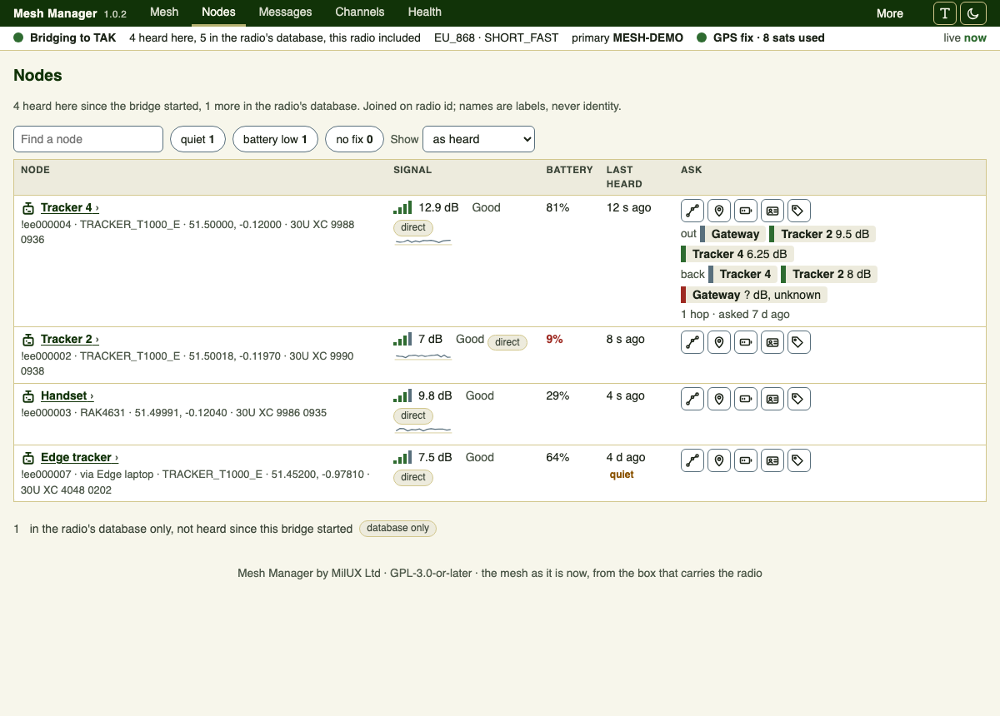

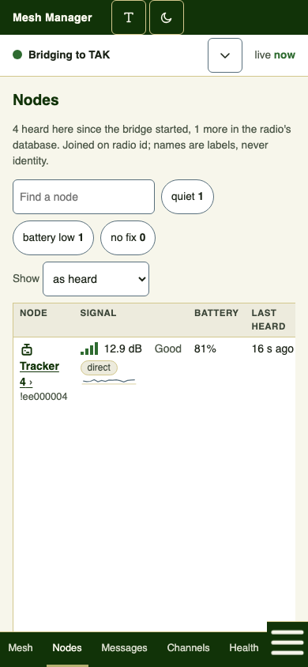

## Messages

Messages is a chat. The list on the left has one chat per channel, one per radio you have spoken to
directly, and one per group, newest first, each with its last line, the time and an unread count.
Press one to open it on the right; up to three open side by side on a laptop, one at a time on a
phone.

Your messages sit on the right with their receipt: *handed to the radio*, then *delivered* when the
radio confirms, or *not delivered* with the radio's reason. Everyone else's sit on the left with the
sender. A direct message sends on Enter. A message to a channel or a group asks first, because every
device hears it and it costs airtime; a message to everyone is never acknowledged, and the bubble says
so. A group message is one direct message per member, each with its own receipt.

The quick messages above the field are set on Settings; a press fills the field and nothing is sent
until you send it.

**Starting a chat.** *New message* above the list opens a picker: type a label or a radio id and choose a
radio, a channel or a group, spoken to or not. A full radio id the box has not heard yet is offered too, marked
*not in the register*, so you can call a radio before it has said anything.

**Keeping the list in order.** Each open chat has a menu (the three dots), and each row answers a right-click,
with the same choices: *Mark as read*, *Mark as unread* (the chat closes and shows one unread until you open
it again), *Pin to the top*, *Mute* (no unread count, a marker instead) and *Hide this chat* (it leaves the
list; *Show hidden* below the tools brings it back, and opening it unhides it). *Mark all read* is on the
toolbar. The unread total, muted and hidden chats excluded, sits beside the tools and in the browser tab's
title. The field above the list finds a chat by name or id, or a line by its text, and says how many lines
matched. When you open a chat, a red *New messages* line marks the first line you have not seen.

**On a bubble.** Hover or focus a bubble for *Copy*. A message of yours the radio gave up on offers *Send
again*: the same text to the same radio.

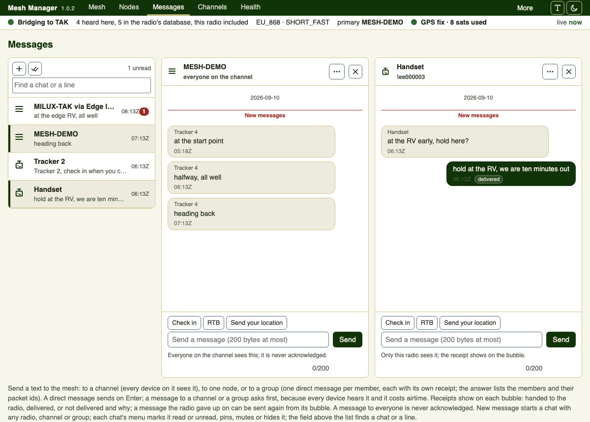

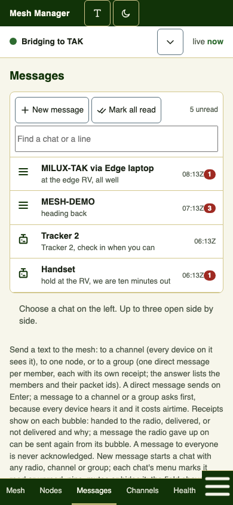

## Channels

The radio's channel slots, with the name, role and whether a key is set; never the key itself. Each
row can rotate its key, delete the slot (not the primary), show its join QR, and push the slot to
every managed device over the air, one after another, each read back before it counts.

**Create a channel** mints a fresh key on the box and writes a secondary channel to a free slot.
**Adopt a join URL** takes channels from a URL you were given: read it first (the screen says what
it carries, never the key), then add to free slots, or replace everything, which is dressed as the
danger it is and asks for a tick.

After a key rotation, **Since the key rotation** counts every expected device back on the new key,
because a packet the radio can decode carries it. The join QR shows in a sheet that closes itself
after a minute; show it only to a device you mean to join.

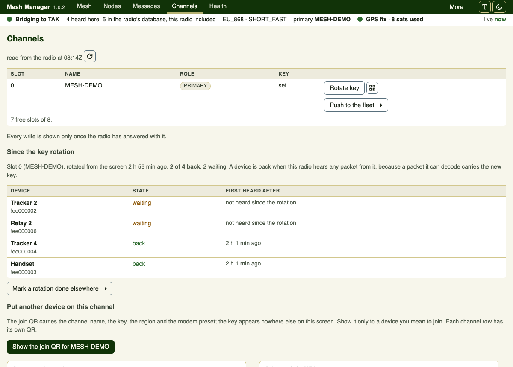

## Bench

Radios plugged into the box by USB, one card each, named by what they are. **Read** opens the
device on its cable and shows what it says about itself. **Onboard** gives it long and short names,
a role (the hint under the role says what each does), this radio's primary channel and key, region
and preset, and this radio's public key as an admin key, every one read back; a label and a holder
go into the register in the same act. Under **More for this device**: export its configuration to
the box, restore one, or flash firmware from the shelf. Nothing flashes before a read.

A device in bootloader mode answers nothing; its card gives the three-step drill and names the file.
**The shelf** below lists the firmware pinned for the fleet and whether the file on the box is
verified against its hash.

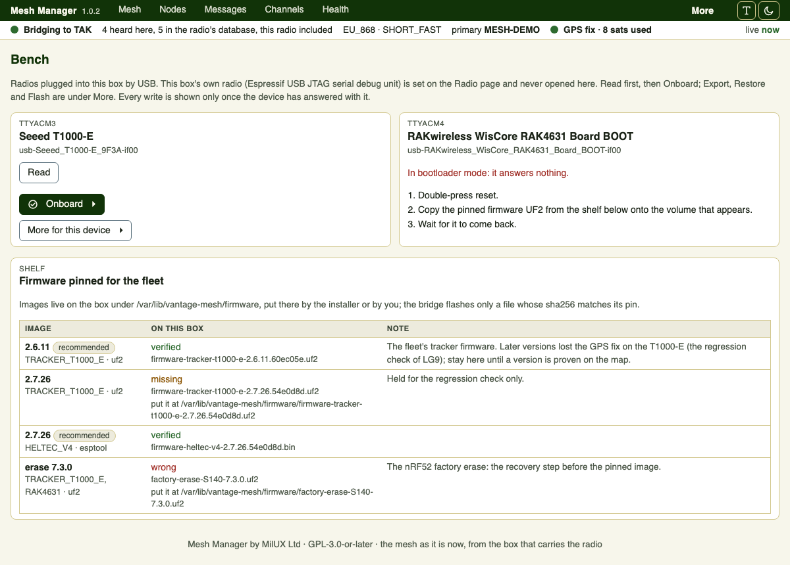

## Register and groups

The fleet the box knows: the node's own name beside your label and holder, hardware, the firmware
each device itself reported and whether it is behind the shelf's image, the fingerprint of the key
each radio holds and since when, whether it is managed, when it was heard and for how much of the
last day. A changed key is an alarm until you accept it, because a changed key is a reflashed radio
or an impostor.

A device is managed only when a read of the device itself showed this radio's key among its admin
keys; **Over the air** on a managed row reads and writes it through the mesh. **Forget** removes a
node from the radio's database and the lists; it comes back if heard again.

**Groups** is a fold below the table: a group is a word you give devices (a section, a vehicle, the
routers) with a map icon its devices carry unless one has its own. **Fleet profile** and **Drift**
below compare every device's last read-back against the settings the fleet should carry.

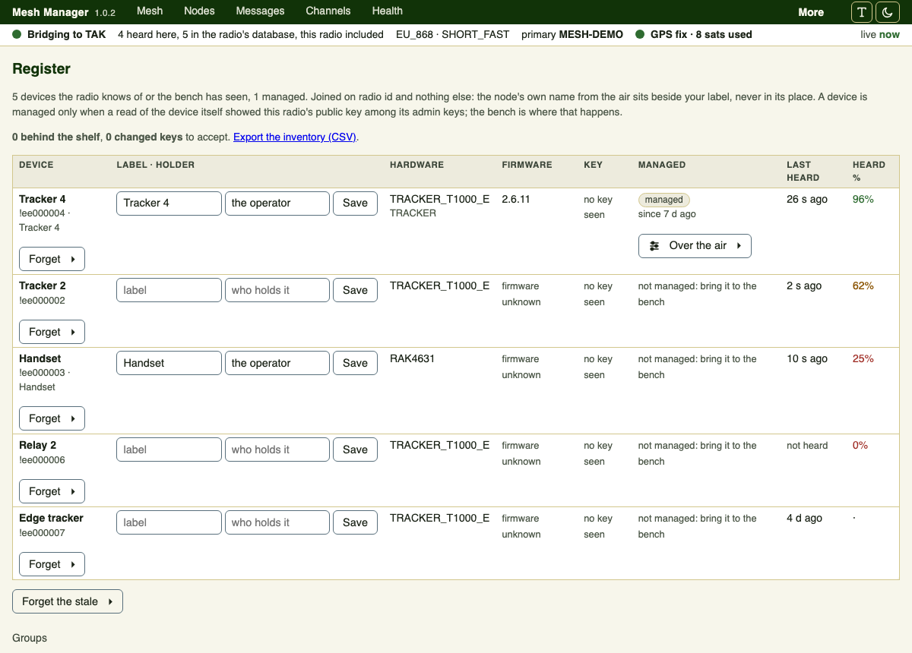

## Health and alerts

Alerts first: what is open and what was recent. A registered device gone quiet, a battery under the
threshold, a node not in the register, a node outside the fence around the box, a fence crossing, a
changed key. Each is shown here and sent to All Chat Rooms on the TAK Server when To TAK chat is on.
**Thresholds** is a fold: minutes of silence, the battery percentage, the radius round the box,
and two switches.

Then how busy the mesh is: channel utilisation with a plain verdict, this radio's transmit time
against the region's duty-cycle budget, packets per hour, and a table per node. **Export** at the
bottom gives positions as GPX, KML or CSV, and messages, packets, battery and environment as CSV,
for a report or for Pinecone.

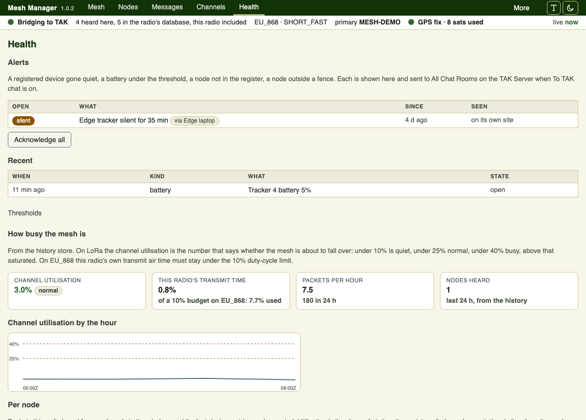

## Joining meshes

Two meshes out of radio range can be one picture, one chat and one set of waypoints. A site opens an
authenticated link to another Mesh Manager over the internet; items cross with the name of the site they came
from, and a sharing table per peer says what leaves, what shows and what goes on the air.

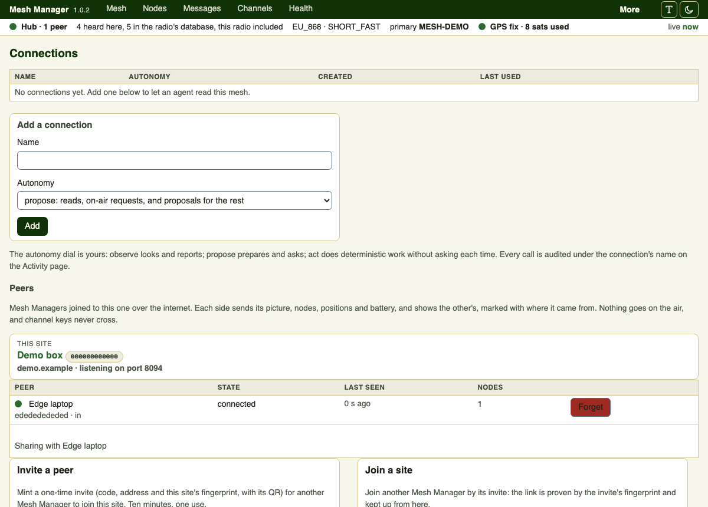

### Sites, invites and the hub

On the site that listens (a hub, or a box installed with `--peer-bind`), press *Invite a peer* on Connections:
it shows a code with the site's address and fingerprint, good for ten minutes and one use, with a QR. On the
other site, paste that text into *Join a site*. From then on the two are joined: each sends its picture, the
nodes it hears with their positions, battery and signal, and shows the other's on Nodes and the map marked
*via <site>*. The site that dials needs nothing opened on its network. A hub is a Mesh Manager with no radio,
installed with `--mode hub`, that several sites join; it passes each site's picture, messages, waypoints and
alerts on to the others. *Forget* drops a peer at either end: its picture, waypoints and open alerts leave
the screen, and what it said stays in the history as your record.

### What gets shared where

Each peer's row opens *Sharing*: four classes, the picture (nodes, positions, battery, signal), messages,
waypoints and alerts, each with Out (this leaves your site for that peer) and In (this shows here from that
peer). Messages also take the channel indexes whose broadcasts leave; empty means every channel. Out of the
box the picture, waypoints and alerts flow both ways and messages stay home. A channel that arrives from a
peer shows in Messages as its own chat, *MILUX-TAK via edge*; typing there sends your words to that site
over the link.

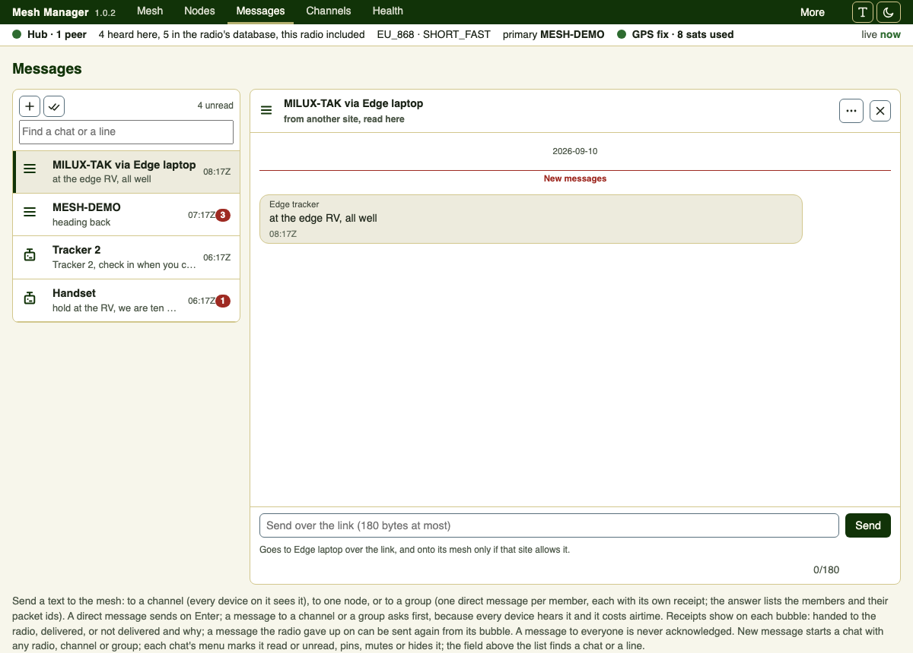

### The air

At a site with a radio, each peer's messages row and waypoints row carry a third switch, Air, off by default.
With it on, what arrives from that peer is transmitted on your mesh: a message goes out as a broadcast on the
channel you name (or the arriving one), prefixed with the peer's name, and shows in your own chat marked
with where it came from; a waypoint goes out named for its origin. Airtime is yours, so the fold counts what
it has aired for each peer. The bubble's receipt then reads *on the air at edge* when that site allows it, or
*not aired: that site keeps its air closed* when it does not. A hub has no radio and no Air switch.

### After a gap

What crossed a link is kept in the history with the site it came from, so a remote chat is still there after
a reload or a restart. When a link comes back, each side asks the other for what it missed since the last
message it holds from that side (up to 24 hours, 200 messages), and the answer fills the gap in order; live
waypoints and open alerts come with the picture, so a hub that restarted has them within seconds. Caught-up
messages are history: they show on the screen and never go on the air.

### What never crosses

Direct messages, channel keys and channel URLs, admin keys, tokens and passwords, device configuration and
firmware are not on the table and never cross. This is not a convention: the link refuses to send an item
carrying any of those, and refuses one that arrives carrying them, whoever sent it. Node names and labels
are what the mesh already says of itself. The written review of the link's data handling is in the
repository under `docs/security/`.

### What it costs

Nothing in software. One site of a pair has to be reachable: a box with its own address, or a tunnel such
as Tailscale or WireGuard, from £0 to about £6 a month. The link is TLS 1.2 or better with each side's
certificate pinned after the first code; the screens of a hub stay on loopback and are reached over a tunnel
until a TLS route is added.

## Settings

The standing brief for connected agents (what this mesh is for, its rules; served to every agent
as `mesh_context`), **Where this box is** (a declared position for the map when the box has no
receiver; a receiver's fix still comes first), the quick messages, and the update settings: a
GitHub token kept on the box and never shown again, and the mode: check daily and install on your
press, install on its own, or never talk to GitHub. Each form has its own Save and says when it saved.

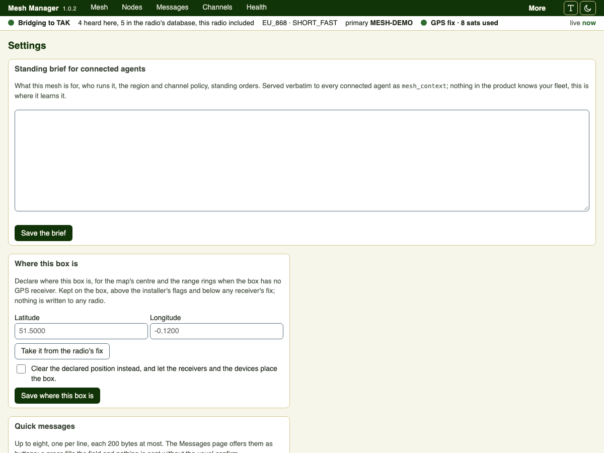

## Updates

About shows the running version, when the box last checked, and **Update now** when a newer release
exists: it downloads the release, checks its hash, and the box installs it with the settings it
already has; the bridge and the screen restart, so the mesh is off TAK for about a minute. **Roll
back** re-applies a release the box already holds, hash checked, without an SSH session.

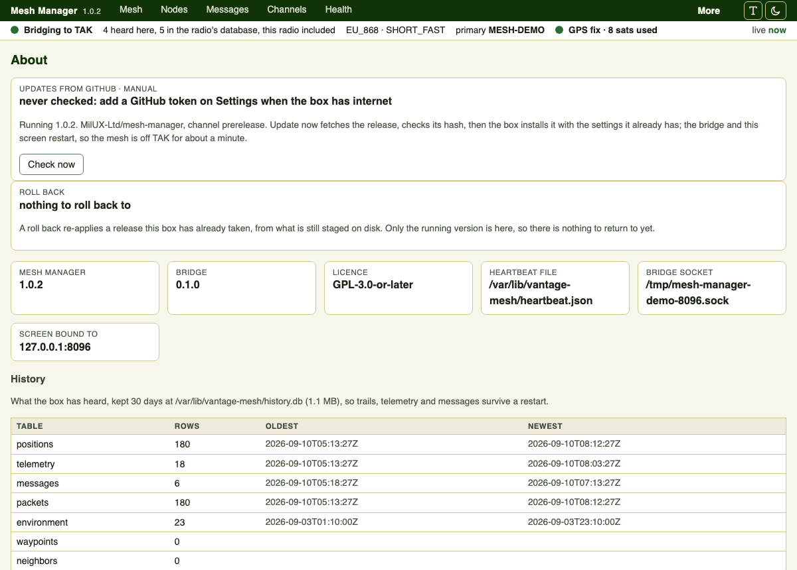

## Connections and agents

An AI agent can connect to the box over MCP with a token you add here, at one of three autonomy
levels: observe (reads only), propose (reads, on-air requests, and proposals for the rest, which
wait for you on Activity), or act. Every call is audited under the connection's name on Activity.
The role and skills that travel with the product tell an agent how to behave on a mesh.

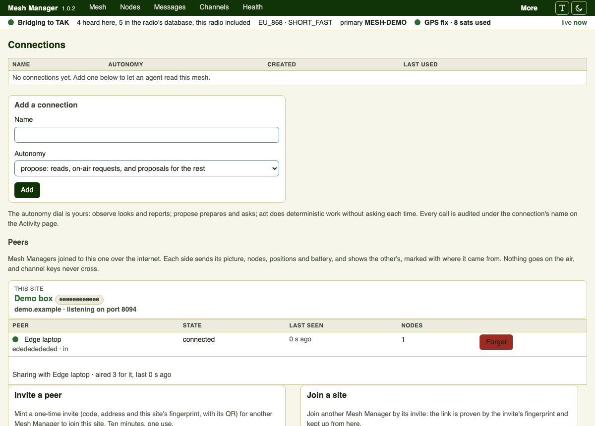

## Help

The kit as it is: this radio, its region and channel, the fleet, the shelf, the lessons paid for on
real meshes, the four states of a write, and where things are on the box. Start there when something
is wrong.

